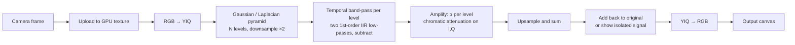

# Eulerian Video Magnification – Web App Plan

A browser-only app that amplifies tiny colour changes (pulse) and tiny motions
(breathing, vibration) in a live camera feed, with sliders for tuning the
filter in real time. Works from a laptop webcam or a phone camera. No server,
no uploads: every frame is processed on the device's GPU.

Reference: Wu et al., *Eulerian Video Magnification for Revealing Subtle
Changes in the World*, SIGGRAPH 2012.

---

## 1. Goals and non-goals

**Goals**

- Real-time (target 30 fps) magnification of the live camera stream.
- Two modes: **colour** (pulse, blushing) and **motion** (breathing, vibration).
- Tunable via sliders with immediate visual feedback and sensible presets.
- Works on desktop Chrome/Firefox/Safari and on iOS Safari + Android Chrome.
- Installable as a PWA, deployable as a static site (GitHub Pages).
- Optional: record the output, and show a heart-rate estimate from a region.

**Non-goals (v1)**

- Offline/batch processing of uploaded videos (nice later, not first).
- Phase-based magnification (Wadhwa et al. 2013). Higher quality but much
  heavier; keep the engine interface open for it as a v2 option.
- Any backend, accounts, or cloud storage.

---

## 2. Algorithm (linear EVM, IIR temporal filter)

The linear method decomposes each frame spatially, band-pass filters each
pixel over time, scales the result, and adds it back.



**Why IIR instead of an FFT "ideal" filter:** an FFT needs a ring buffer of
tens of frames per pixel and per level, which is memory- and bandwidth-heavy
on mobile. Two cascaded exponential low-passes give a usable band-pass with
one state texture per level and O(1) work per pixel per frame. This is what
the original authors used for their real-time motion demo.

Per frame, per level, with `dt` = real elapsed seconds since last frame:

```
rLo = exp(-2π · fLow  · dt)        // slower low-pass
rHi = exp(-2π · fHigh · dt)        // faster low-pass
lowState  = mix(x, lowState,  rLo)
highState = mix(x, highState, rHi)
band = highState - lowState
```

Computing the coefficients from measured `dt` keeps the cutoff in Hz correct
even when the camera or browser drops frames.

**Amplification rules**

- Colour mode: filter only the coarsest pyramid level (heavy spatial blur),
  large α (50–150), chromatic attenuation ≈ 1 (we *want* the colour signal).
- Motion mode: filter the Laplacian levels, α bounded per level by
  `α_max = λ / (8·δ) − 1` where λ is the spatial wavelength at that level and
  δ the expected displacement. Levels finer than the cutoff wavelength λ_c get
  α attenuated linearly to zero to avoid ringing. Chromatic attenuation ≈ 0.1.
- Reset the IIR state textures when the band or mode changes so the user does
  not see a multi-second transient.

**Practical camera issues to design for**

- Auto-exposure and auto white balance fight colour amplification. Lock them
  with `track.applyConstraints({ exposureMode: 'manual', whiteBalanceMode: 'manual' })`
  where supported, and tell the user when it is not.
- Mains flicker (50/60 Hz) aliases into the band on phones. Provide a preset
  hint and a notch-free band choice; document it.
- Camera noise dominates at high α in low light. Offer a spatial blur / lower
  processing resolution slider as the noise remedy.

---

## 3. Architecture

Client-only static site. The processing engine is framework-agnostic and the
UI is a thin layer around it.

```
src/
  engine/                  # no framework dependency, unit-testable
    Engine.ts              # public API: start/stop, setParams, onStats
    gl/
      context.ts           # WebGL2 setup, EXT_color_buffer_float check
      programs.ts          # shader compile + uniform helpers
      pingpong.ts          # framebuffer pairs for IIR state per level
    shaders/
      yiq.frag             # colour space in/out
      downsample.frag      # 5-tap Gaussian, half res
      upsample.frag
      laplacian.frag       # level_i − upsample(level_{i+1})
      temporal.frag        # IIR update, band extraction, amplification
      composite.frag       # sum levels, blend with original, isolate view
    params.ts              # typed params, presets, clamping, α-bound math
    roi.ts                 # mean signal over a region → 1-D series
    spectrum.ts            # small FFT on the 1-D series → peak Hz / BPM
  camera/
    devices.ts             # enumerate cameras, facingMode toggle
    stream.ts              # getUserMedia, constraints, exposure lock
    frameSource.ts         # requestVideoFrameCallback → engine.pushFrame
  ui/                      # React components
    App.tsx
    Viewer.tsx             # output canvas, tap-to-set ROI, fullscreen
    ControlPanel.tsx       # slider groups, presets, mode toggle
    sliders/
      LogSlider.tsx        # α on a log scale
      RangeSlider.tsx      # dual-thumb low/high Hz with BPM readout
      Slider.tsx           # shared styling, value pill, touch targets
    SignalChart.tsx        # live ROI trace + BPM
    StatsBar.tsx           # fps, processing res, GPU time
    RecordButton.tsx       # MediaRecorder → WebM download
  main.tsx
public/
  manifest.webmanifest, icons, sw.js (Workbox, precache only)
```

**GPU API choice: WebGL2 first.** Fragment shaders with framebuffer ping-pong
cover everything above and run on iOS Safari, Android Chrome, and all desktop
browsers. WebGPU compute would be cleaner but adds a second code path for
little gain at these resolutions. Leave an `EngineBackend` interface so a
WebGPU backend can be added later.

**Precision:** IIR state in `RGBA16F` textures (via `EXT_color_buffer_float`),
falling back to a two-texture 8-bit encoding if the extension is missing.
Half floats are enough for the band signal since the state tracks the input,
not an accumulation.

**Frame timing:** `HTMLVideoElement.requestVideoFrameCallback` where
available (gives real presentation timestamps for `dt`), else
`requestAnimationFrame`. Pause processing when the tab is hidden.

---

## 4. Tech stack

| Concern | Choice | Why |
|---|---|---|
| Build | Vite + TypeScript | fast, static output, GLSL import via `vite-plugin-glsl` |
| UI | React 19 | broad slider/component ecosystem |
| Styling | Tailwind CSS | quick, consistent dark UI that looks good over video |
| Sliders | Radix UI `Slider` primitive | accessible, keyboard + touch, multi-thumb support for the Hz range |
| State | Zustand | tiny store shared by sliders, engine, and URL sync |
| Tests | Vitest + Playwright | pure math in Vitest; shader and camera smoke tests in headless Chromium |
| Deploy | GitHub Pages via Actions | free HTTPS, which `getUserMedia` requires on phones |

---

## 5. Controls and sliders

All sliders update engine uniforms on every change event, so tuning is live.
Values sync to the URL query string so a good setting can be shared or
bookmarked.

| Control | Type | Range / default | Notes |
|---|---|---|---|
| Mode | segmented toggle | Colour / Motion | switches pyramid strategy and chromatic default |
| Amplification α | log slider | 1 – 200, default 30 | log scale so 1–10 is as easy to set as 50–200 |
| Frequency band | dual-thumb range | 0.05 – 10 Hz | shows Hz and BPM (×60) under each thumb; enforce low < high with a minimum gap |
| Spatial cutoff λ_c | slider | 4 – 256 px | motion mode; caps α per level |
| Pyramid levels | stepper | 2 – 6 | auto-limited by processing resolution |
| Chromatic attenuation | slider | 0 – 1 | how much I/Q get amplified relative to Y |
| Processing resolution | select | 240p / 360p / 480p / 720p | main performance lever on phones |
| Blend | slider | 0 – 1 | 0 = original, 1 = fully magnified; also an "isolate signal" toggle |
| Denoise | slider | 0 – 3 | extra Gaussian taps before the pyramid |

**Presets** (one tap, then fine-tune):

- **Pulse / face** – colour mode, 0.8–3 Hz (48–180 BPM), α 80, λ_c n/a, res 360p
- **Breathing** – motion mode, 0.15–0.8 Hz, α 15, λ_c 64
- **Vibration / machinery** – motion mode, 3–10 Hz, α 20, λ_c 16
- **Wrist pulse** – motion mode, 0.8–3 Hz, α 40, λ_c 32
- **Reset**

**Slider UX details**

- Large touch targets (44 px thumbs on mobile), values shown in a pill that
  follows the thumb while dragging.
- Double-tap a slider to reset it to the preset value.
- Hold-to-compare button: shows the raw feed while pressed.
- Panel collapses to a bottom sheet on phones so the video stays large.

---

## 6. Mobile specifics

- HTTPS only; show a clear message on `http://` or when permission is denied.
- Front/back camera toggle via `facingMode`; remember the choice.
- Handle orientation changes: re-create framebuffers when the video's
  intrinsic size changes.
- Request a `WakeLock` while running so the screen stays on.
- PWA manifest + minimal service worker so it launches full-screen from the
  home screen. Do not cache camera frames.
- Battery: default to 360p processing on phones, 480p on desktop.

---

## 7. Extras (after the core works)

- **Signal chart + BPM:** tap the video to place a region of interest; average
  the amplified Y channel there each frame (`readPixels` on a tiny downsampled
  target), keep ~10 s of history, run a small FFT, show the peak as BPM.
- **Record:** `canvas.captureStream()` → `MediaRecorder` → WebM download.
  Show file size while recording.
- **Split view:** original | magnified side by side, or a draggable wipe.
- **Video file input:** drag a clip in and run the same pipeline with looping.

---

## 8. Milestones

| # | Milestone | Done when |
|---|---|---|
| 0 | Scaffold | Vite + React + Tailwind app, camera preview on desktop and phone over HTTPS, GitHub Pages deploy green |
| 1 | Colour magnification | single coarse level, IIR band-pass, α slider and band range slider working live; pulse visible on a face in good light |
| 2 | Motion magnification | Laplacian pyramid, per-level α bound, λ_c slider, mode toggle; breathing visible on a seated person |
| 3 | Control panel polish | all sliders and presets from §5, URL sync, hold-to-compare, bottom sheet on mobile |
| 4 | Mobile hardening | exposure/WB lock, orientation handling, wake lock, PWA install, 30 fps at 360p on a mid-range Android phone |
| 5 | Signal chart + BPM | ROI tap, live trace, BPM estimate within ±5 of a reference in a calm test |
| 6 | Recording and extras | MediaRecorder export, split view, video file input |

Each milestone is a PR. Milestones 1 and 2 are where the risk is; the rest is
UI work with known solutions.

---

## 9. Testing

- **Unit (Vitest):** IIR coefficient math for varying `dt`; α bound per level;
  pyramid level sizes; preset clamping; BPM peak picking on synthetic sine
  data.
- **Shader smoke (Playwright, headless Chromium with SwiftShader):** compile
  every program, run one frame on a synthetic texture, assert no GL errors and
  a non-black output.
- **End-to-end synthetic:** feed a generated video (a disc whose brightness
  oscillates at 1.2 Hz, and one that moves ±0.5 px at 0.3 Hz) through the
  engine with `--use-fake-device-for-media-stream`; assert the ROI spectrum
  peaks at the right frequency and that the amplified displacement scales
  with α.
- **Manual device matrix:** iPhone Safari, Pixel Chrome, MacBook Chrome and
  Safari, Windows Firefox. Checklist kept in `docs/DEVICE_TESTS.md`.

---

## 10. Risks and mitigations

| Risk | Mitigation |
|---|---|
| `EXT_color_buffer_float` missing on some Android GPUs | 8-bit hi/lo encoding fallback for state textures |
| Auto-exposure wipes out the colour signal | lock exposure/WB when supported, otherwise show a warning and suggest steady light |
| Frame drops make cutoff frequencies drift | derive IIR coefficients from measured `dt` each frame |
| Phone overheats / throttles at 720p | default to 360p, expose resolution select, show fps in the stats bar |
| iOS Safari quirks (`requestVideoFrameCallback`, autoplay, canvas capture) | feature-detect each, keep `requestAnimationFrame` and screenshot-only fallbacks |
| Ringing / artefacts at large α in motion mode | enforce the λ/(8δ) bound automatically, expose λ_c as the user-facing knob |

---

## 11. First concrete steps

1. `npm create vite@latest` (react-ts), add Tailwind, Radix Slider, Zustand,
   `vite-plugin-glsl`, Vitest, Playwright.
2. Camera module: permission flow, device list, facing toggle, preview.
3. `Engine` with a single pass-through shader to prove the
   video → texture → canvas path on desktop and phone.
4. Add the IIR temporal pass on one downsampled level + α and band sliders.
   This is the first moment the app is useful; ship it to Pages and test on a
   face.
5. Continue with the milestone table.
